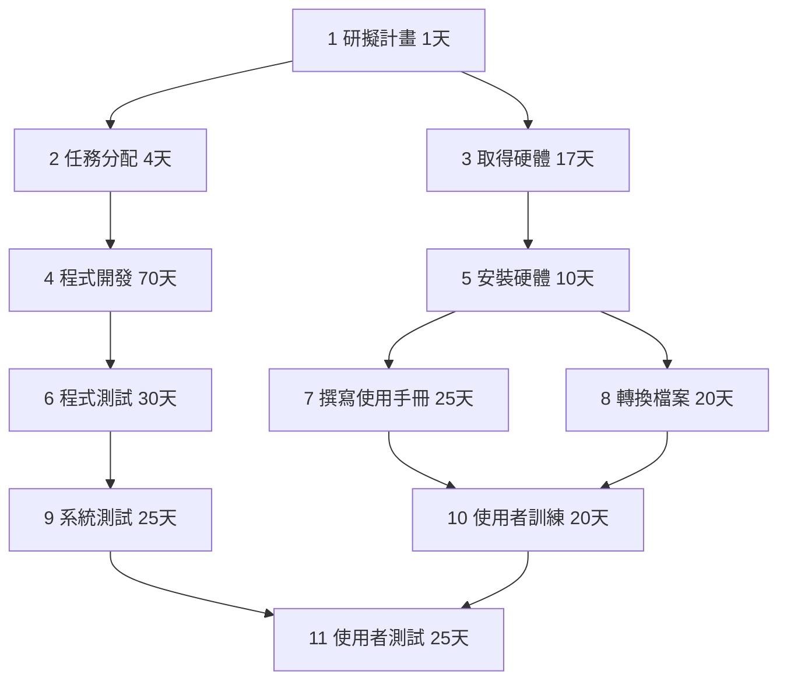

# HW2 – PERT/CPM 與甘特圖

## 工作分解結構 (WBS)

| 任務 | 說明         | 工期(天) | 前置任務 |
|------|--------------|---------|----------|
| 1    | 研擬計畫     | 1       | -        |
| 2    | 任務分配     | 4       | 1        |
| 3    | 取得硬體     | 17      | 1        |
| 4    | 程式開發     | 70      | 2        |
| 5    | 安裝硬體     | 10      | 3        |
| 6    | 程式測試     | 30      | 4        |
| 7    | 撰寫使用手冊 | 25      | 5        |
| 8    | 轉換檔案     | 20      | 5        |
| 9    | 系統測試     | 25      | 6        |
| 10   | 使用者訓練   | 20      | 7, 8     |
| 11   | 使用者測試   | 25      | 9, 10    |

---

## (1) PERT/CPM 圖

```mermaid
gantt
    dateFormat  DD
    title 專案甘特圖
    section 計畫
    研擬計畫         :done,    t1, 0, 1d
    任務分配         :active,  t2, after t1, 4d
    section 硬體
    取得硬體         :t3, after t1, 17d
    安裝硬體         :t5, after t3, 10d
    section 軟體
    程式開發         :t4, after t2, 70d
    程式測試         :t6, after t4, 30d
    系統測試         :t9, after t6, 25d
    section 文件與使用者
    撰寫使用手冊     :t7, after t5, 25d
    轉換檔案         :t8, after t5, 20d
    使用者訓練       :t10, after t7, 20d
    使用者訓練       :t10b, after t8, 20d
    使用者測試       :t11, after t9, 25d
    使用者測試       :t11b, after t10, 25d
```

markdown 
## (3) 關鍵路徑 
- **路徑 1**：1 → 2 → 4 → 6 → 9 → 11 = 155 天 ✅ (關鍵路徑)
- 路徑 2：1 → 3 → 5 → 7 → 10 → 11 = 98 天
- 路徑 3：1 → 3 → 5 → 8 → 10 → 11 = 93 天

